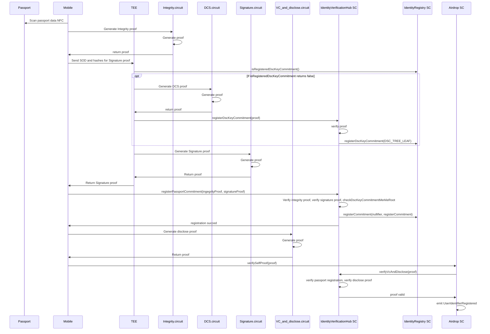

```mermaid
sequenceDiagram
    participant P as Passport
    participant M as Mobile
    participant TEE as TEE
    participant I as Integrity.circuit
    participant DCS as DCS.circuit
    participant S as Signature.circuit
    participant VC as VC_and_disclose.circuit
    participant HUB as IdentityVerificationHub SC
    participant IR as IdentityRegistry SC
    participant A as Airdrop SC
    M ->> P: Scan passport data NFC
    M ->> I: Generate Integrity proof
    I ->> I: Generate proof
    I ->> M: return proof
    M ->> TEE: Send SOD and hashes for Signature proof
    TEE ->> IR: isRegisteredDscKeyCommitment()
    opt If isRegisteredDscKeyCommitment returns false
        TEE ->> DCS: Generate DCS proof
        DCS ->> DCS: Generate proof
        DCS ->> TEE: return proof
        TEE ->> HUB:registerDscKeyCommitment(proof)
        HUB ->> HUB: verify proof
        HUB ->> IR: registerDscKeyCommitment(DSC_TREE_LEAF)
    end
    TEE ->> S: Generate Signature proof
    S ->> S: Generate proof
    S ->> TEE: Return proof
    TEE ->> M: Return Signature proof
    M ->> HUB: registerPassportCommitment(ingegrityProof, signatureProof)
    HUB ->> HUB: Verify integrity proof, verify signature proof, checkDscKeyCommitmentMerkleRoot
    HUB ->> IR: registerCommitment(nullifier, registerCommitment)
    HUB ->> M: registration succed
    M ->> VC: Generate disclose proof
    VC ->> VC: Generate proof
    VC ->> M: Return proof
    M ->> A: verifySelfProof(proof)
    A ->> HUB: verifyVcAndDisclose(proof)
    HUB ->> HUB: verify passport registration, verify disclose proof
    HUB ->> A: proof valid
    A ->> A: emit UserIdentifierRegistered
   

```