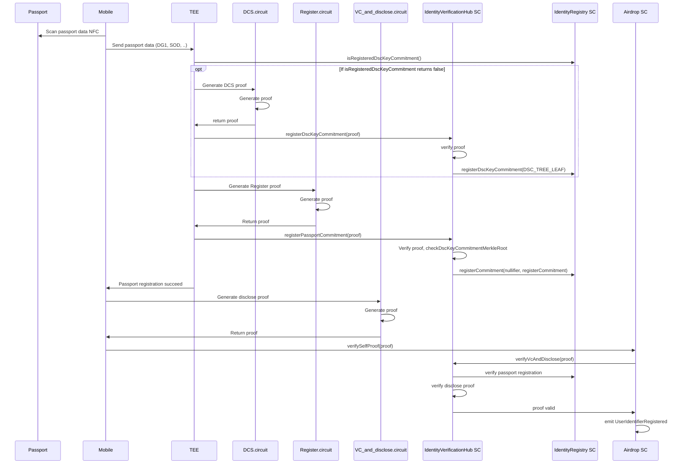

```mermaid
sequenceDiagram
    participant P as Passport
    participant M as Mobile
    participant TEE as TEE
    participant DCS as DCS.circuit
    participant R as Register.circuit
    participant VC as VC_and_disclose.circuit
    participant HUB as IdentityVerificationHub SC
    participant IR as IdentityRegistry SC
    participant A as Airdrop SC
    M ->> P: Scan passport data NFC
    M ->> TEE: Send passport data (DG1, SOD, ..)
    TEE ->> IR: isRegisteredDscKeyCommitment()
    opt If isRegisteredDscKeyCommitment returns false
        TEE ->> DCS: Generate DCS proof
        DCS ->> DCS: Generate proof
        DCS ->> TEE: return proof
        TEE ->> HUB:registerDscKeyCommitment(proof)
        HUB ->> HUB: verify proof
        HUB ->> IR: registerDscKeyCommitment(DSC_TREE_LEAF)
    end
    TEE ->> R: Generate Register proof
    R ->> R: Generate proof
    R ->> TEE: Return proof
    TEE ->> HUB: registerPassportCommitment(proof)
    HUB ->> HUB: Verify proof, checkDscKeyCommitmentMerkleRoot
    HUB ->> IR: registerCommitment(nullifier, registerCommitment)
    TEE ->> M: Passport registration succeed
    M ->> VC: Generate disclose proof
    VC ->> VC: Generate proof
    VC ->> M: Return proof
    M ->> A: verifySelfProof(proof)
    A ->> HUB: verifyVcAndDisclose(proof)
    HUB ->> IR: verify passport registration
    HUB ->> HUB: verify disclose proof
    HUB ->> A: proof valid
    A ->> A: emit UserIdentifierRegistered
   

```